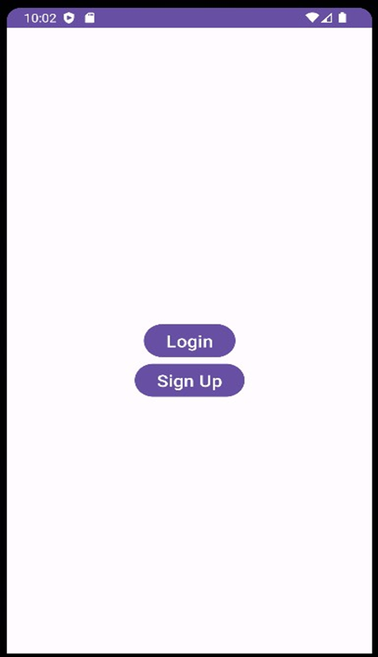

# P4_21012011046
Submitted By: MAKWANA SWASTIK PRAVIN

Enrollment Number: 21012011046

This Android app consists of two activities, `LoginActivity` and `RegistrationActivity`, each using a different layout and explicit intents to navigate between them.

## LoginActivity

### `activity_login.xml`

The `LoginActivity` layout is created using ConstraintLayout and includes elements like an ImageView, TextViews, EditTexts, and a Button for logging in.

```xml
<?xml version="1.0" encoding="utf-8"?>
<androidx.constraintlayout.widget.ConstraintLayout xmlns:android="http://schemas.android.com/apk/res/android"
    xmlns:app="http://schemas.android.com/apk/res-auto"
    xmlns:tools="http://schemas.android.com/tools"
    android:layout_width="match_parent"
    android:layout_height="match_parent"
    tools:context=".MainActivity">

    <ImageView
        android:id="@+id/imageView"
        android:layout_width="match_parent"
        android:layout_height="200dp"
        app:layout_constraintStart_toStartOf="parent"
        app:layout_constraintTop_toTopOf="parent"
        app:srcCompat="@drawable/guni_pink_logo" />

    <TextView
        android:id="@+id/textView7"
        android:layout_width="wrap_content"
        android:layout_height="wrap_content"
        android:text="Don't have an account?"
        android:textSize="15dp"
        android:textStyle="bold"
        app:layout_constraintBaseline_toBaselineOf="@+id/button2"
        app:layout_constraintEnd_toEndOf="parent"
        app:layout_constraintHorizontal_bias="0.302"
        app:layout_constraintStart_toStartOf="parent" />

    <Button
        android:id="@+id/button2"
        android:layout_width="wrap_content"
        android:layout_height="wrap_content"
        android:text="Sign Up"
        android:backgroundTint="#00F4C2C2"
        android:textColor="#e75480"
        app:rippleColor="#FFC0CB"
        app:strokeColor="#AB1F1F"
        android:textSize="20dp"
        android:textStyle="bold"
        app:layout_constraintBottom_toBottomOf="parent"
        app:layout_constraintEnd_toEndOf="parent"
        app:layout_constraintHorizontal_bias="0.088"
        app:layout_constraintStart_toEndOf="@+id/textView7"
        app:layout_constraintTop_toBottomOf="@+id/materialCardView"
        app:layout_constraintVertical_bias="0.311"
        />

    <com.google.android.material.card.MaterialCardView
        android:id="@+id/materialCardView"
        android:layout_width="match_parent"
        android:layout_height="300dp"
        android:layout_marginHorizontal="20dp"
        app:cardCornerRadius="20dp"
        app:cardElevation="20dp"
        app:layout_constraintStart_toStartOf="parent"
        app:layout_constraintTop_toBottomOf="@id/imageView">

        <androidx.constraintlayout.widget.ConstraintLayout
            android:layout_width="match_parent"
            android:layout_height="match_parent">


            <TextView
                android:id="@+id/textView"
                android:layout_width="wrap_content"
                android:layout_height="wrap_content"
                android:layout_marginStart="20dp"
                android:text="Password"
                android:textSize="20sp"
                android:textStyle="bold"
                app:layout_constraintBaseline_toBaselineOf="@+id/password_toggle"
                app:layout_constraintStart_toStartOf="parent" />

            <EditText
                android:id="@+id/editTextTextEmailAddress"
                android:layout_width="wrap_content"
                android:layout_height="wrap_content"
                android:layout_marginTop="32dp"
                android:ems="10"
                android:inputType="textEmailAddress"
                app:layout_constraintEnd_toEndOf="parent"
                app:layout_constraintHorizontal_bias="0.514"
                app:layout_constraintStart_toEndOf="@+id/textView2"
                app:layout_constraintTop_toTopOf="parent" />

            <TextView
                android:id="@+id/textView2"
                android:layout_width="wrap_content"
                android:layout_height="wrap_content"
                android:layout_marginStart="20dp"
                android:text="Email Id"
                android:textSize="20sp"
                android:textStyle="bold"
                app:layout_constraintBaseline_toBaselineOf="@+id/editTextTextEmailAddress"
                app:layout_constraintStart_toStartOf="parent" />

            <EditText
                android:id="@+id/password_toggle"
                android:layout_width="wrap_content"
                android:layout_height="wrap_content"
                android:ems="10"
                android:inputType="textPassword"
                app:layout_constraintBottom_toBottomOf="parent"
                app:layout_constraintEnd_toEndOf="parent"
                app:layout_constraintHorizontal_bias="0.507"
                app:layout_constraintStart_toEndOf="@+id/textView2"
                app:layout_constraintTop_toBottomOf="@+id/editTextTextEmailAddress"
                app:layout_constraintVertical_bias="0.157" />

            <TextView
                android:id="@+id/textView3"
                android:layout_width="wrap_content"
                android:layout_height="wrap_content"
                android:layout_marginStart="20dp"
                android:text="Forget Password?"
                android:textSize="20sp"
                android:textStyle="bold"
                app:layout_constraintBottom_toBottomOf="parent"
                app:layout_constraintStart_toStartOf="parent"
                app:layout_constraintTop_toBottomOf="@+id/textView"
                app:layout_constraintVertical_bias="0.275" />

            <Button
                android:id="@+id/btnclick"
                android:layout_width="wrap_content"
                android:layout_height="wrap_content"
                android:text="Log In"
                app:layout_constraintBottom_toBottomOf="parent"
                app:layout_constraintEnd_toEndOf="parent"
                app:layout_constraintHorizontal_bias="0.498"
                app:layout_constraintStart_toStartOf="parent"

                app:layout_constraintTop_toBottomOf="@+id/textView3"


                app:layout_constraintVertical_bias="0.666" />
        </androidx.constraintlayout.widget.ConstraintLayout>

    </com.google.android.material.card.MaterialCardView>


</androidx.constraintlayout.widget.ConstraintLayout>
```

### `Login.kt`

The `LoginActivity` handles the logic for the login page and includes a button to navigate to the `RegistrationActivity`.

```kotlin
package com.example.practical_4

import android.content.Intent
import androidx.appcompat.app.AppCompatActivity
import android.os.Bundle
import android.view.View

class Login : AppCompatActivity() {
    override fun onCreate(savedInstanceState: Bundle?) {
        super.onCreate(savedInstanceState)
        setContentView(R.layout.activity_login)
        val button2 = findViewById<View>(R.id.button2)

        button2.setOnClickListener {
            val intent = Intent(this, SignUp::class.java)
            startActivity(intent)
        }
    }
}
```

## RegistrationActivity

### `activity_sign_up.xml`

The `RegistrationActivity` layout is created using LinearLayout and includes various input fields for user registration. It also has a button to complete the registration.

```xml
<?xml version="1.0" encoding="utf-8"?>
<LinearLayout xmlns:android="http://schemas.android.com/apk/res/android"
    xmlns:app="http://schemas.android.com/apk/res-auto"
    android:orientation="vertical"
    xmlns:tools="http://schemas.android.com/tools"
    android:layout_width="match_parent"
    android:layout_height="match_parent"
    android:id="@+id/SignUp"
    tools:context=".RegistrationActivity">

    <ImageView
        android:layout_width="match_parent"
        android:layout_height="200dp"
        app:srcCompat="@drawable/guni_pink_logo" />

    <com.google.android.material.card.MaterialCardView
        android:id="@+id/materialCardView"
        android:layout_width="match_parent"
        android:layout_height="wrap_content"
        android:layout_marginHorizontal="20dp"
        app:cardCornerRadius="15dp"
        app:cardElevation="30dp">

        <LinearLayout
            android:paddingTop="20dp"
            android:paddingBottom="50dp"
            android:layout_width="match_parent"
            android:layout_height="wrap_content"
            android:orientation="vertical">

            <LinearLayout
                android:layout_width="match_parent"
                android:layout_height="wrap_content"
                android:orientation="horizontal">

                <TextView
                    android:layout_width="0dp"
                    android:layout_height="wrap_content"
                    android:text="User Full Name"
                    android:paddingStart="10dp"
                    android:textSize="20dp"
                    android:layout_weight="0.3"></TextView>

                <EditText
                    android:layout_width="0dp"
                    android:layout_height="wrap_content"
                    android:layout_weight="0.3" />

            </LinearLayout>

            <LinearLayout
                android:layout_width="match_parent"
                android:layout_height="wrap_content"
                android:orientation="horizontal">

                <TextView
                    android:layout_width="0dp"
                    android:layout_height="wrap_content"
                    android:text="Phone Number"
                    android:paddingStart="10dp"
                    android:textSize="20dp"
                    android:layout_weight="0.3"></TextView>

                <EditText
                    android:layout_width="0dp"
                    android:layout_height="wrap_content"
                    android:layout_weight="0.3"></EditText>

            </LinearLayout>

            <LinearLayout
                android:layout_width="match_parent"
                android:layout_height="wrap_content"
                android:orientation="horizontal">

                <TextView
                    android:layout_width="0dp"
                    android:layout_height="wrap_content"
                    android:text="City"
                    android:paddingStart="10dp"
                    android:textSize="20dp"
                    android:layout_weight="0.3"></TextView>

                <EditText
                    android:layout_width="0dp"
                    android:layout_height="wrap_content"
                    android:layout_weight="0.3"></EditText>

            </LinearLayout>

            <LinearLayout
                android:layout_width="match_parent"
                android:layout_height="wrap_content"
                android:orientation="horizontal">

                <TextView
                    android:layout_width="0dp"
                    android:layout_height="wrap_content"
                    android:text="Email"
                    android:paddingStart="10dp"
                    android:textSize="20dp"
                    android:layout_weight="0.3"></TextView>

                <EditText
                    android:layout_width="0dp"
                    android:layout_height="wrap_content"
                    android:layout_weight="0.3"></EditText>
                "
            </LinearLayout>


            <LinearLayout
                android:layout_width="match_parent"
                android:layout_height="wrap_content"
                android:orientation="horizontal">

                <TextView
                    android:layout_width="0dp"
                    android:layout_height="wrap_content"
                    android:text="Password"
                    android:paddingStart="10dp"
                    android:textSize="20dp"
                    android:layout_weight="0.3"></TextView>

                <EditText
                    android:layout_width="0dp"
                    android:layout_height="wrap_content"
                    android:layout_weight="0.3"></EditText>
                "
            </LinearLayout>

            <LinearLayout
                android:layout_width="match_parent"
                android:layout_height="wrap_content"
                android:orientation="horizontal">

                <TextView
                    android:layout_width="0dp"
                    android:layout_height="wrap_content"
                    android:text="Conform Password"
                    android:paddingStart="10dp"
                    android:textSize="20dp"
                    android:layout_weight="0.4"></TextView>

                <EditText
                    android:layout_width="0dp"
                    android:layout_height="wrap_content"
                    android:layout_weight="0.3"></EditText>
                "
            </LinearLayout>


        </LinearLayout>
    </com.google.android.material.card.MaterialCardView>

    <LinearLayout
        android:layout_gravity="center"
        android:layout_marginTop="-20dp"
        android:layout_width="wrap_content"
        android:layout_height="wrap_content"
        android:elevation="30dp"
        android:orientation="vertical">
        <Button
            android:layout_width="wrap_content"
            android:layout_height="wrap_content"
            android:text="Registration"/>

    </LinearLayout>
    <LinearLayout
        android:layout_width="match_parent"
        android:layout_height="wrap_content"
        android:orientation="horizontal">

        <TextView
            android:layout_width="0dp"
            android:layout_height="wrap_content"
            android:textSize="16dp"
            android:textStyle="bold"
            android:paddingStart="30dp"
            android:layout_weight="0.6"
            android:text="Don't have an account?">

        </TextView>

        <Button
            android:id="@+id/button"
            android:layout_width="0dp"
            android:layout_height="wrap_content"
            android:text="Login"
            android:textStyle="bold"
            android:textSize="20dp"
            android:layout_marginEnd="60dp"
            android:background="#00FFFFFF"
            android:textColor="#DB3D91"
            android:layout_weight="0.4" />


    </LinearLayout>

</LinearLayout>
```

### `SignUp.kt`

The `RegistrationActivity` handles the user registration logic and includes a button to navigate back to the `LoginActivity`.

```kotlin
package com.example.practical_4

import android.annotation.SuppressLint
import android.content.Intent
import androidx.appcompat.app.AppCompatActivity
import android.os.Bundle
import android.view.View
import com.example.practical_4.R.layout.activity_sign_up

class SignUp : AppCompatActivity() {
    @SuppressLint("MissingInflatedId")
    override fun onCreate(savedInstanceState: Bundle?) {

        super.onCreate(savedInstanceState)
        setContentView(R.layout.activity_sign_up)
        val button = findViewById<View>(R.id.button)

        button.setOnClickListener {
            val intent = Intent(this, Login::class.java)
            startActivity(intent)
        }
    }
}

```

## Main Activity

### `activity_main.xml`

The main activity layout contains buttons to switch between the `LoginActivity` and the `RegistrationActivity`. It uses ConstraintLayout.

```xml
<?xml version="1.0" encoding="utf-8"?>
<androidx.constraintlayout.widget.ConstraintLayout xmlns:android="http://schemas.android.com/apk/res/android"
    xmlns:app="http://schemas.android.com/apk/res-auto"
    xmlns:tools="http://schemas.android.com/tools"
    android:layout_width="match_parent"
    android:layout_height="match_parent"
    tools:context=".MainActivity">

<Button
    android:layout_width="wrap_content"
    android:layout_height="wrap_content"
    android:id="@+id/button1"
    android:text="Login"
    android:textSize="20dp"
    app:layout_constraintStart_toStartOf="parent"
    app:layout_constraintEnd_toEndOf="parent"
    app:layout_constraintTop_toTopOf="parent"
    app:layout_constraintBottom_toBottomOf="parent"></Button>
<Button
    android:layout_width="wrap_content"
    android:layout_height="wrap_content"
    android:text="Sign Up"
    android:textSize="20dp"
    android:id="@+id/button2"
    app:layout_constraintTop_toBottomOf="@id/button1"
    app:layout_constraintStart_toStartOf="parent"
    app:layout_constraintEnd_toEndOf="parent"></Button>

</androidx.constraintlayout.widget.ConstraintLayout>
```

### `MainActivity.kt`

The main activity handles the navigation between the `LoginActivity` and the `RegistrationActivity` using explicit intents.

```kotlin
package com.example.practical_4

import android.content.Intent
import androidx.appcompat.app.AppCompatActivity
import android.os.Bundle
import android.view.View

class MainActivity : AppCompatActivity()
{
    override fun onCreate(savedInstanceState: Bundle?)
    {
        super.onCreate(savedInstanceState)
        setContentView(R.layout.activity_main)
        val button = findViewById<View>(R.id.button1)
        val button2 = findViewById<View>(R.id.button2)

        button.setOnClickListener {
            val intent = Intent(this, Login::class.java)
            startActivity(intent)
        }

        button2.setOnClickListener {
            val intent = Intent(this, SignUp::class.java)
            startActivity(intent)
        }
    }
}
```

## Screenshots




